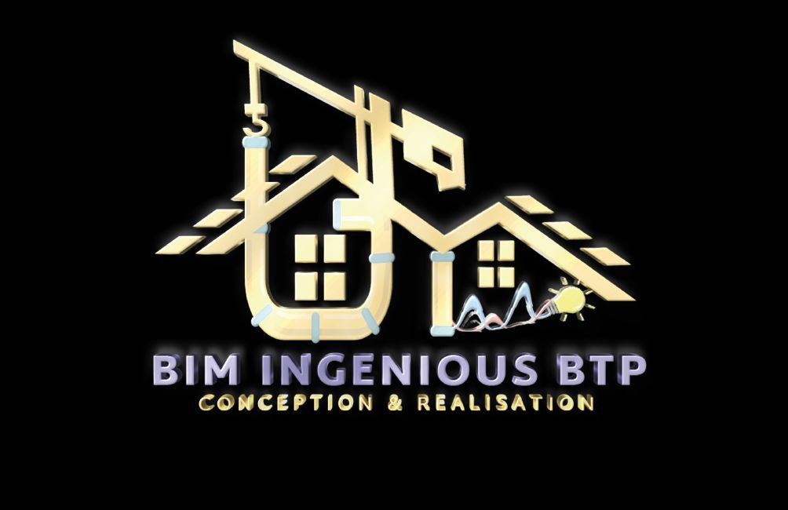

 

 # CRÉATION D’UN SITE VITRINE DE BIM INGENIOUS BTP
## About Laravel

Laravel is a web application framework with expressive, elegant syntax. We believe development must be an enjoyable and creative experience to be truly fulfilling. Laravel takes the pain out of development by easing common tasks used in many web projects, such as:

- [Simple, fast routing engine](https://laravel.com/docs/routing).
- [Powerful dependency injection container](https://laravel.com/docs/container).
- Multiple back-ends for [session](https://laravel.com/docs/session) and [cache](https://laravel.com/docs/cache) storage.
- Expressive, intuitive [database ORM](https://laravel.com/docs/eloquent).
- Database agnostic [schema migrations](https://laravel.com/docs/migrations).
- [Robust background job processing](https://laravel.com/docs/queues).
- [Real-time event broadcasting](https://laravel.com/docs/broadcasting).

Laravel is accessible, powerful, and provides tools required for large, robust applications.
 

## Historique de modification du document

| Date              | Motif                                      | Type        |
|------------------|------------------------------------------|------------|
| 19 décembre 2025 | Définition des fonctionnalités et devis  | Création   |
| 27 décembre 2025 | Mise à jour des modalités et révision du document après retour | Mise à jour |
| 14 janvier 2025  | Planification du déroulement du projet dans le temps | Mise à jour |

Le présent document fait suite à celui soumis précédemment par BIM INGENIOUS BTP, dont le contenu portait sur la description dudit projet. Celui-ci vient donc en complément en termes fonctionnels et comportera le devis du projet module par module.

 

## Contexte

Le développement d'un site Web pour l’entreprise BIM INGENIOUS BTP s'inscrit dans un contexte de digitalisation croissante des services de construction et d'ingénierie...

## Objectifs

- Présenter l'expertise de BIM INGENIOUS BTP
- Renforcer la visibilité numérique
- Faciliter la communication avec les clients potentiels
- Mettre en valeur les réalisations et références
- Attirer de nouveaux clients et partenaires

## Les acteurs

- **Administrateur** : Chargé de la gestion générale du site.
- **Éditeur** : Toute personne inscrite sur le site faisant partie de l’équipe interne.
- **Visiteur** : Clients potentiels, partenaires professionnels, investisseurs...

## Modules fonctionnels

| #  | Module/Sous-module | Acteur(s) |
|----|-------------------|-----------|
| M001 | Gestion de compte | * |
| M001-SM001 | Ajout d’un Utilisateur | Administrateur |
| M001-SM002 | Mise à jour de compte | Utilisateur |
| M001-SM003 | Suppression du compte | * |
| M001-SM004 | Réinitialisation du mot de passe | * |
| M001-SM005 | Bloquer un compte | Administrateur |
| ... | ... | ... |

## Durée estimative

Le projet pourra être développé et livré sur une période allant de **2 à 3 mois** à compter de la date de lancement.

 
 
## Livrables

- Lien officiel du site web fonctionnel
- Code source commenté
- Planning projet
- Cahier de recettes (tests)
- Documentation technique
 